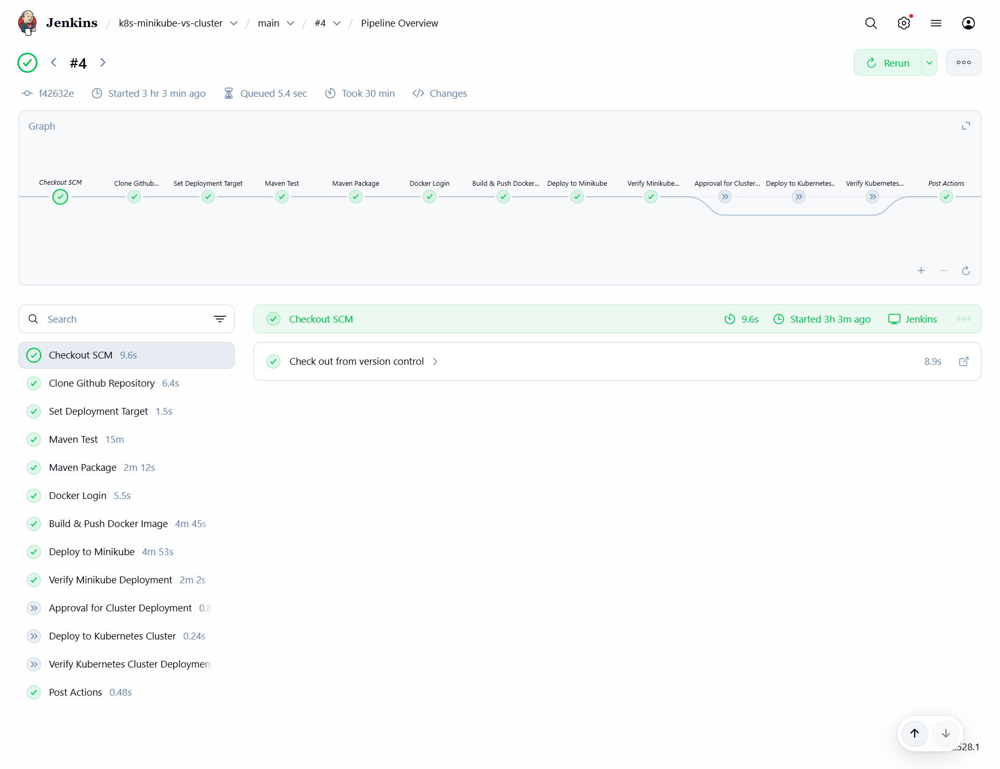

# Multi-Environment CI/CD Pipeline: Minikube & Kubernetes Cluster

A **CI/CD pipeline for a Spring Boot application** using **Jenkins, Docker, and Kubernetes**.

The pipeline supports **two deployment targets** with automatic selection based on **GitHub webhook context**:

* **Minikube** – local development and testing (triggered by pushes to `main`)
* **Kubernetes Cluster** – production environment (triggered by Git tags)

A single **Jenkins Pipeline job** and **one Jenkinsfile** manage build, Docker image publishing, and deployment for both environments.

---

## Project Structure

```
.
├── minikube-deploy/        # Local deployment resources
│   ├── deployment.yaml
│   ├── docs/
│   └── README.md           # Minikube-specific setup & instructions
├── cluster-deploy/         # Remote cluster resources
│   ├── deployment.yaml
│   ├── docs/
│   └── README.md           # Cluster-specific setup & instructions
├── Jenkinsfile             # CI/CD pipeline definition
├── scripts/                # CI/CD helper scripts
│   └── docker-tag.sh
└── README.md               # Project overview
```

**Notes:**

* Each deployment folder contains **environment-specific Kubernetes manifests**.
* The **Jenkinsfile** controls build, Docker image creation, and deployment.
* The deployment target is selected automatically using **GitHub webhook payload data**.

---

## Deployment Targets

### 1. Minikube

* Triggered automatically on **push to `main`**
* Runs on the **Jenkins VM** using Minikube
* Used for **local development, testing, and CI validation**
* Kubernetes manifests are stored in `minikube-deploy/`
* Deployment details and screenshots are documented in:

  * `minikube-deploy/README.md`
  * `minikube-deploy/docs/`

---

### 2. Kubernetes Cluster (Production)

* Triggered automatically on **Git tag push** (`vX.Y.Z`)
* Deploys to a **remote Kubernetes cluster**
* Simulates a **production environment**
* Requires **manual approval in Jenkins** before deployment
* Kubernetes manifests are stored in `cluster-deploy/`
* Deployment details and screenshots are documented in:

  * `cluster-deploy/README.md`
  * `cluster-deploy/docs/`

---

## Jenkins Pipeline Overview

* A **Jenkins Pipeline job** is used.
* The pipeline is triggered by **GitHub webhooks**.
* Deployment target selection is based on the Git reference received in the webhook payload.

### Deployment Target Resolution

```groovy
DEPLOY_TARGET = env.TAG_NAME?.startsWith('v') ? 'cluster' : 'minikube'
```

| Git Event         | Deployment Target  |
| ----------------- | ------------------ |
| Push to `main`    | Minikube           |
| Push tag `vX.Y.Z` | Kubernetes cluster |

---

## Jenkins Pipeline Job Configuration

### Job Type

* **Jenkins job:** Pipeline
* **Pipeline definition:** Pipeline script from SCM
* **SCM:** Git
* **Repository URL:**

  ```
  git@github.com:rouisskhawla/k8s-minikube-vs-cluster.git
  ```
* **Credentials:** GitHub SSH key
* **Script Path:** `Jenkinsfile`

---

## Webhook Trigger Configuration (Generic Webhook Trigger)

The pipeline is triggered using the **Generic Webhook Trigger** plugin.

### Required Jenkins Plugin

* **Generic Webhook Trigger**

---

### Build Trigger Settings

In the Jenkins Pipeline job configuration:

1. Go to **Build Triggers**
2. Enable **Generic Webhook Trigger**

---

### Extract Variables from GitHub Payload

Configure the following **Post content parameters**:

| Variable          | JSONPath Expression | Description              |
| ----------------- | ------------------- | ------------------------ |
| `ref`             | `$.ref`             | Full Git reference       |
| `ref_type`        | `$.ref_type`        | Identifies branch or tag |
| `repository_name` | `$.repository.name` | Repository name          |

All parameters must have **JSONPath** enabled.

**Screenshot for configuration:**

  * [Pipeline Job Configuration](docs/pipeline-job-config.png)

---

### Trigger Options

* **Token:** `k8s-webhook-token`
* **Print post content:** enabled (for debugging)
* **Print contributed variables:** enabled (for debugging)

---

## GitHub Webhook Setup (via ngrok)

To allow GitHub to reach Jenkins running on a private VM, **ngrok** is used.

### 1. Install ngrok on Jenkins VM

```bash
curl -sSL https://ngrok-agent.s3.amazonaws.com/ngrok.asc \
  | sudo tee /etc/apt/trusted.gpg.d/ngrok.asc >/dev/null \
  && echo "deb https://ngrok-agent.s3.amazonaws.com bookworm main" \
  | sudo tee /etc/apt/sources.list.d/ngrok.list \
  && sudo apt update \
  && sudo apt install ngrok
```

Add authentication token:

```bash
ngrok config add-authtoken <YOUR_NGROK_TOKEN>
```

---

### 2. Start ngrok Tunnel

```bash
ngrok http 8080
```

Example public URL:

```
https://1dfd9fa21209.ngrok-free.app
```

---

### 3. Configure GitHub Webhook

In the GitHub repository settings:

| Setting          | Value                                                                        |
| ---------------- | ---------------------------------------------------------------------------- |
| Payload URL      | `https://<ngrok-url>/generic-webhook-trigger/invoke?token=k8s-webhook-token` |
| Content type     | `application/json`                                                           |
| Secret           | *(empty)*                                                                    |
| SSL verification | Enabled                                                                      |
| Trigger events   | Just the push event                                                          |

Example:

```
https://1dfd9fa21209.ngrok-free.app/generic-webhook-trigger/invoke?token=k8s-webhook-token
```

**Screenshot:**

[GitHub Webhook Successful Deliveries](docs/github-webhook-deliveries.png)

[GitHub Webhook Configuration](docs/github-webhook-config.png)


---

## Jenkins Environment Variables Used

| Variable       | Source                 | Purpose                      |
| -------------- | ---------------------- | ---------------------------- |
| `ref`          | GitHub webhook payload | Raw Git reference            |
| `ref_type`     | GitHub webhook payload | Branch or tag identification |
| `TAG_NAME`     | Parsed from `ref`      | Production release detection |
| `BRANCH_NAME`  | Parsed from `ref`      | Branch-based builds          |
| `BUILD_NUMBER` | Jenkins                | Snapshot image versioning    |

---

## Docker Image Versioning

Docker image tags are generated automatically depending on build type.

### Production Release

* Triggered by Git tag `vX.Y.Z`
* Docker image tag: `X.Y.Z`

Example:

| Git Tag  | Image Tag |
| -------- | --------- |
| `v0.1.0` | `0.1.0`   |

---

### Snapshot Build

* Triggered by a commit on `main`
* Docker image tag: `LATEST_TAG-BUILD_NUMBER`

Where:

* `LATEST_TAG` = latest Git tag (or `0.0.0` if none exist)
* `BUILD_NUMBER` = Jenkins build number

Examples:

| Latest Tag | BUILD_NUMBER | Image Tag |
| ---------- | ------------ | --------- |
| 0.0.1      | 45           | 0.0.1-45  |
| 0.0.2      | 50           | 0.0.2-50  |
| none       | 1            | 0.0.0-1   |

---

## Docker Tagging Script

* **File:** `scripts/docker-tag.sh`
* **Purpose:** Generates Docker image tags for release and snapshot builds

```bash
chmod +x scripts/docker-tag.sh
```

Used in the Jenkinsfile to ensure:

* Clean semantic versioning for production
* Unique snapshot tags for CI builds

---

## Pipeline Execution Flow

### Snapshot (Minikube)

```
Push to main
 → Jenkins Pipeline
    → Maven Build & Tests
    → Docker Image Build & Push
    → Deploy to Minikube
    → Deployment Verification
```



---

### Production (Kubernetes Cluster)

```
Push Git tag vX.Y.Z
 → Jenkins Pipeline
    → Maven Build & Tests
    → Docker Image Build & Push
    → Manual Approval
    → Deploy to Kubernetes Cluster
    → Deployment Verification
```


