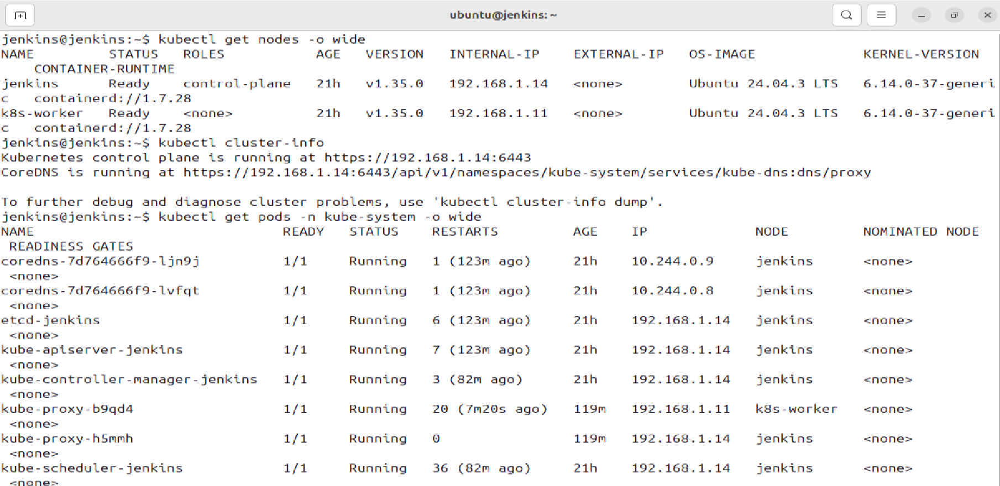

# Cluster Deployment

This folder contains all resources and instructions to deploy the application to a **Kubernetes cluster managed by Jenkins**.
It includes:

* Kubernetes manifests (`deployment.yaml`, `service.yaml`)
* Jenkins pipeline setup
* Instructions for cluster setup and worker node joining
* Access information for the deployed application

---

## 1. Cluster Overview

**Architecture:**

```
GitHub
  │
  └─ Webhook → Jenkins (Manager VM)
        │
        ├─ Build Docker image
        ├─ Push image to Docker Hub
        └─ Deploy to Kubernetes Cluster
              │
              ├─ Control Plane (Manager VM)
              └─ Worker Node (Worker VM)
```

**Example IP Addresses (Bridged Network)**

| VM      | IP           | Role                    |
| ------- | ------------ | ----------------------- |
| Manager | 192.168.1.14 | Control Plane + Jenkins |
| Worker  | 192.168.1.11 | Worker Node             |

**Kubernetes Required Ports:** 6443, 2379-2380, 10250, 10257, 10259

---

## 2. Common Requirements (Both VMs)

Performed these steps **on both Manager and Worker VMs**.

### 2.1 Set Hostnames

```bash
# Manager VM
sudo hostnamectl set-hostname jenkins

# Worker VM
sudo hostnamectl set-hostname k8s-worker
```

Reboot both VMs.

---

### 2.2 Disable Swap

```bash
sudo swapoff -a
sudo sed -i '/ swap / s/^/#/' /etc/fstab
```

---

### 2.3 Configure Kernel Modules

```bash
sudo modprobe overlay
sudo modprobe br_netfilter

# Persist on reboot
cat <<EOF | sudo tee /etc/modules-load.d/k8s.conf
overlay
br_netfilter
EOF
```

---

### 2.4 Configure Networking (sysctl)

```bash
cat <<EOF | sudo tee /etc/sysctl.d/k8s.conf
net.bridge.bridge-nf-call-iptables  = 1
net.bridge.bridge-nf-call-ip6tables = 1
net.ipv4.ip_forward                 = 1
EOF

sudo sysctl --system
```

---

## 3. Install containerd (Both VMs)

### 3.1 Install containerd

```bash
sudo apt-get update
sudo apt-get install -y containerd
```

### 3.2 Configure containerd

```bash
sudo mkdir -p /etc/containerd
containerd config default | sudo tee /etc/containerd/config.toml

sudo sed -i 's/SystemdCgroup = false/SystemdCgroup = true/' /etc/containerd/config.toml
sudo systemctl restart containerd
sudo systemctl enable containerd
```

---

## 4. Install Kubernetes Tools (Both VMs)

### 4.1 Add Kubernetes Repository

```bash
sudo mkdir -p /etc/apt/keyrings

curl -fsSL https://pkgs.k8s.io/core:/stable:/v1.35/deb/Release.key \
 | sudo gpg --dearmor -o /etc/apt/keyrings/kubernetes.gpg

echo "deb [signed-by=/etc/apt/keyrings/kubernetes.gpg] https://pkgs.k8s.io/core:/stable:/v1.35/deb/ /" \
 | sudo tee /etc/apt/sources.list.d/kubernetes.list
```

### 4.2 Install kubeadm, kubelet, kubectl

```bash
sudo apt-get update
sudo apt-get install -y kubelet kubeadm kubectl
sudo apt-mark hold kubelet kubeadm kubectl
```

---

## 5. Manager VM – Initialize Control Plane


### 5.1 Initialize Kubernetes Cluster

```bash
sudo kubeadm init --apiserver-advertise-address=192.168.1.14
```

> Save the **`kubeadm join` command** for the worker VM.

### 5.2 Configure kubectl for Jenkins user

```bash
mkdir -p /var/lib/jenkins/.kube
sudo cp /etc/kubernetes/admin.conf /var/lib/jenkins/.kube/config
sudo su - jenkins
chown $(id -u):$(id -g) $HOME/.kube/config

kubectl get nodes
kubectl get pods -n kube-system
```

### 5.4 Install Pod Network (Flannel)

```bash
kubectl apply -f https://raw.githubusercontent.com/flannel-io/flannel/master/Documentation/kube-flannel.yml
kubectl get pods -n kube-system
```

> Waited until all Flannel pods are `Running`.

---

## 6. Worker VM – Join Cluster

Used the **`kubeadm join`** command saved from Manager VM:

```bash
sudo kubeadm join 192.168.1.14:6443 \
  --token <TOKEN> \
  --discovery-token-ca-cert-hash sha256:<HASH>
```

Verify from Manager VM:

```bash
kubectl get nodes
kubectl get pods -A
```

Expected:

* Manager node → `Ready`
* Worker node → `Ready`

---

### 7. Node IP Configuration & kube-proxy Fix

If `kube-proxy` shows `CrashLoopBackOff` after Flannel installation, configure the kubelet to use the **bridged network IP** via `/etc/default/kubelet`.

#### **7.1 Manager VM**

```bash
sudo tee /etc/default/kubelet <<EOF
KUBELET_EXTRA_ARGS=--node-ip=192.168.1.14
EOF

sudo systemctl daemon-reload
sudo systemctl restart kubelet
```

#### **7.2 Worker VM**

```bash
sudo tee /etc/default/kubelet <<EOF
KUBELET_EXTRA_ARGS=--node-ip=192.168.1.11
EOF

sudo systemctl daemon-reload
sudo systemctl restart kubelet
```

#### **7.3 Recreate kube-proxy Pods**

```bash
kubectl -n kube-system delete pod -l k8s-app=kube-proxy
```

Kubernetes will automatically recreate the `kube-proxy` pods with the correct node IP.

---

✅ After this, running:

```bash
kubectl get pods -n kube-system
kubectl get nodes -o wide
```

Should show:

* `kube-proxy` → `Running`
* Nodes → `Ready` with correct INTERNAL-IP addresses
  


---

### 8. Jenkins CI/CD Integration

#### **8.1 Pipeline Overview**

* Jenkins builds Docker images on push to GitHub
* Built images are pushed to Docker Hub
* Deployment to the Kubernetes cluster requires **manual approval** in Jenkins
* Jenkins applies both the Kubernetes Deployment and Service manifests
* Deployment is verified by checking rollout status, running pods, and service details

#### **8.2 Deployment Stage Description**

* The pipeline pauses for manual confirmation before deploying to the Kubernetes cluster
* After approval, Jenkins applies:

  * `cluster-deploy/deployment.yaml`
  * `cluster-deploy/service.yaml`
* Once deployment is complete, Jenkins verifies:

  * Successful rollout of the Kubernetes deployment
  * Pod status and node placement
  * Service exposure and assigned NodePort

---

### 9. Access Deployed Application

* The application is exposed using a **NodePort** service defined in `service.yaml`
* Retrieve the NodePort assigned to the service:

```bash
kubectl get svc k8s-cluster
```

* Access the application using the Worker Node IP and NodePort:

```
http://192.168.1.11:<NODE_PORT>
```

Replace `<NODE_PORT>` with the value returned by the service listing.


## 10. References

* [Kubernetes docs](https://kubernetes.io/docs/home/)
* [Flannel CNI plugin](https://github.com/flannel-io/flannel)
