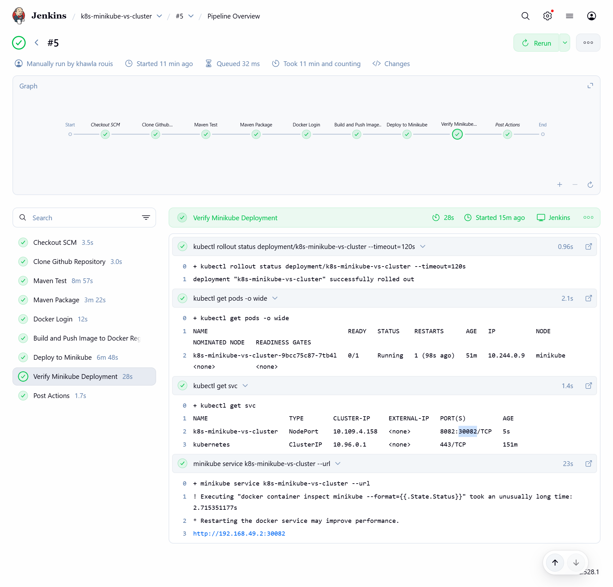

# Minikube Deployment

This folder contains resources to deploy the application to a **local Minikube cluster** running on the Jenkins VM.
It includes the **Kubernetes Deployment manifest**, a **Service manifest**, **screenshots**, and instructions for VM setup, pipeline execution, and troubleshooting.

---

## 1. VM and Environment Setup

### 1.1 Jenkins User Preparation

* Ensure Jenkins is installed and running.
* Docker must be installed and accessible by Jenkins:

```bash
sudo apt-get install -y docker.io
sudo usermod -aG docker jenkins
sudo systemctl restart jenkins
```

---

### 1.2 Install Minikube

1. Download and install Minikube:

```bash
curl -LO https://github.com/kubernetes/minikube/releases/latest/download/minikube-linux-amd64
sudo install minikube-linux-amd64 /usr/local/bin/minikube
rm minikube-linux-amd64
```

* Switch to the Jenkins user for Minikube commands:

```bash
sudo su - jenkins

```

2. Start Minikube using Docker:

```bash
minikube start --driver=docker
```

3. Verify cluster status:

```bash
minikube status
kubectl get nodes
```

---

### 1.3 Install kubectl

Followed this installation for Ubuntu 24.04:

```bash
sudo mkdir -p /etc/apt/keyrings
curl -fsSL https://pkgs.k8s.io/core:/stable:/v1.35/deb/Release.key \
  | sudo gpg --dearmor -o /etc/apt/keyrings/kubernetes.gpg
echo "deb [signed-by=/etc/apt/keyrings/kubernetes.gpg] https://pkgs.k8s.io/core:/stable:/v1.35/deb/ /" \
  | sudo tee /etc/apt/sources.list.d/kubernetes.list
sudo apt-get update
sudo apt-get install -y kubectl
```

Check version:

```bash
kubectl version --client
```

---

## 2. Jenkins Pipeline

The **Jenkinsfile** in the project root performs the full CI/CD pipeline.
For Minikube deployment, the pipeline:

1. **Clones the repository**
2. **Runs Maven build and tests**
3. **Packages the application**
4. **Logs in to Docker Hub**
5. **Builds and pushes the Docker image**
6. **Deploys to Minikube**
7. **Verifies rollout and pod readiness**

**Manual approvals:**

* Docker image build and push
* Minikube deployment

---

### 2.1 Deployment Stage

* Apply the **Deployment manifest**:

```bash
kubectl apply -f minikube-deploy/deployment.yaml
```

* Apply the **Service manifest** (NodePort):

```bash
kubectl apply -f minikube-deploy/service.yaml
```

* Wait for deployment rollout:

```bash
kubectl rollout status deployment/k8s-minikube-vs-cluster --timeout=120s
```

* The pod container listens on **port 8082**.
* The Service exposes it as **NodePort 30082**.

---

### 2.2 Verification

List pods:

```bash
kubectl get pods -o wide
```

Confirm the pod is **Running and Ready**.

List services:

```bash
kubectl get svc
```



---

### 2.3 Accessing the App

**Option 1 – Minikube Service URL:**

```bash
minikube service k8s-minikube-vs-cluster --url
```

* Outputs a URL like `http://192.168.49.2:30082`.

**Option 2 – NodePort + Minikube IP:**

```bash
minikube ip
# Combine with NodePort
http://<minikube-ip>:30082
```

## 3. Screenshots

Deployment state and pod logs are documented in:


* [Minikube Docs](minikube-deploy/docs/)


---

## 4. Tips & Troubleshooting

* **Pod not Ready:** Used a readiness probe in `deployment.yaml`:

```yaml
readinessProbe:
  httpGet:
    path: /
    port: 8082
  initialDelaySeconds: 5
  periodSeconds: 5
```

---
